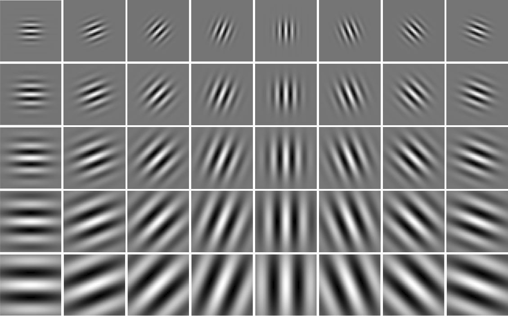

% Activities for the AOI
% Christophe Pallier
% Feb. 2014

Preparing experiments
---------------------

For an experiment, your research assistant has created lists of stimuli for each participant (files list_XXXX.csv). He was asked to avoid any repetition of stimuli within a list. Detect if the files contain any repetition (and print them).

You have been given a Python script that displays  sentences words by word [rsvp.py](rsvp.py). Install the expyriment module for python and run the script. Can you do something so that sentences are presented as a whole rather than word by word?

For a fMRI "language localizer", participants will read a series of sentences (from the file [sentences.txt](sentences.txt)). To create a low-level baseline, you must create matched "pseudosentences" where each word is replaced by a pseudoword of the same length, containing the same letters, but in a random order.

Learn about [regular expressions](http://www.regular-expressions.info/).
To study the orthographic structure of French, you have been asked to find all sequences of vowels and all sequences of consonants. You can use the list of French word available [here]http://www.pallier.org/ressources/dicofr/dicofr.html). 

Gabor patterns are widely used in vision research. 

Write a program that generates a series of Gabor patterns of various orientation and frequencies (to select relevant values, see Foley et al. (2007) Detection of Gabor Patterns of Different Sizes, Shapes, Phases and Eccentricities, Vision Research.)

To probe basic auditory perception, one can present pure tones embedded in white noise. Create a one second segement of white noise, and add on top of it pure tones of 200ms of varying frequencies and amplitudes. Each stimuli must be saved in a different wav file. These stimuli could be used to determine  thresholds of perception by frequencies.

Data Analysis
-------------

You have received data from an experiment (file Data-Experiment1.csv), in which subjects were tested under two conditions (A and B). There reaction times and error rates were measured. You must analyse these data (that is, decide whether it supports the idea that one condition is more difficult than the other).

Exploring some ideas
--------------------

Learn about [Zipf's law](en.wikipedia.org/wiki/Zipf's_law). Download
the text of a long document (e.g., [Alice in
Wonderland](http://www.pallier.org/cours/AIP2013/alice.txt) ). Create
the graphics showing the frequency of occurrence of words as a
function of their rank. Plot also the relationship between word length
and frequency (relevance to Cognition: see Piantadosi, Tily, Gibson
(2011) Word lengths are optimized for efficient communication)

Read about Benford's law, on
[wikipedia](http://en.wikipedia.org/wiki/Benford%27s_law) and
[here](http://mathworld.wolfram.com/BenfordsLaw.html). Find a large
dataset of numbers on the web (e.g. population of cities) and check of
Benford law applies. (For relevance to Cognition, see Dehaene, S. and
Mehler, J. (1992) Cross-linguistic regularities in the frequency of
number words. Cognition, 43, 1–29.)

